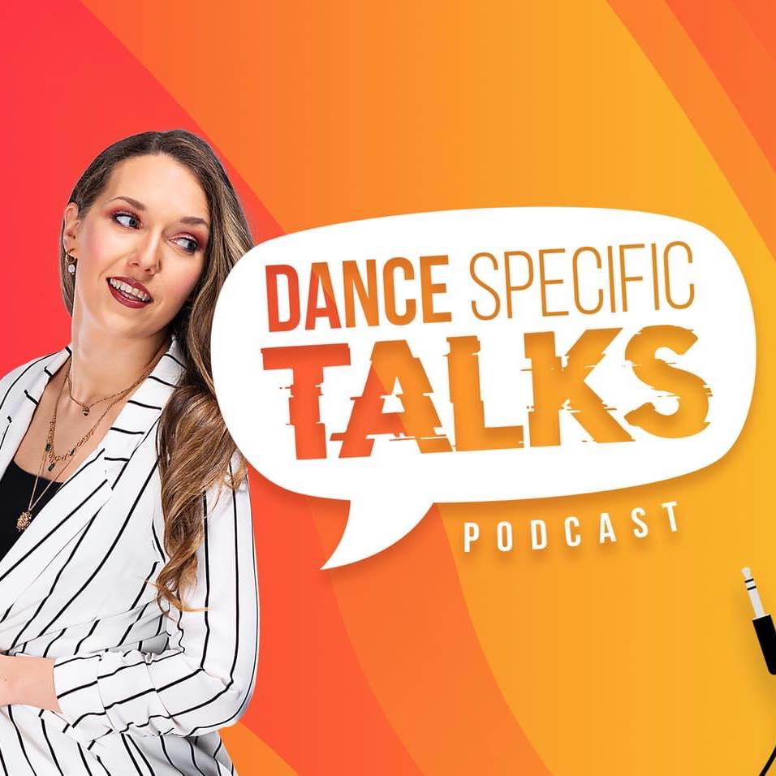

# Dance Specific Talks (#1 Dance Podcast)

       

This is a personal project done for the podcast Dance Specific TALKS. 

At this time, you can:
 - View markers on a map that point to the countries where the podcast guests are from
 - Listen to podcasts interviews
 - Display information on the guests
 - Switch between Light and Dark mode

This application is built with [React.js](https://reactjs.org/). It also makes use of the [Context API](https://reactjs.org/docs/context.html) and [Styled Components](https://styled-components.com/).

## Authors 💻

- **Malcolm R. Kente** - _Lead Developer_ - [reMRKable Dev](https://remrkabledev.com/)

## Acknowledgements
This project was bootstrapped with [Create React App](https://github.com/facebook/create-react-app).

